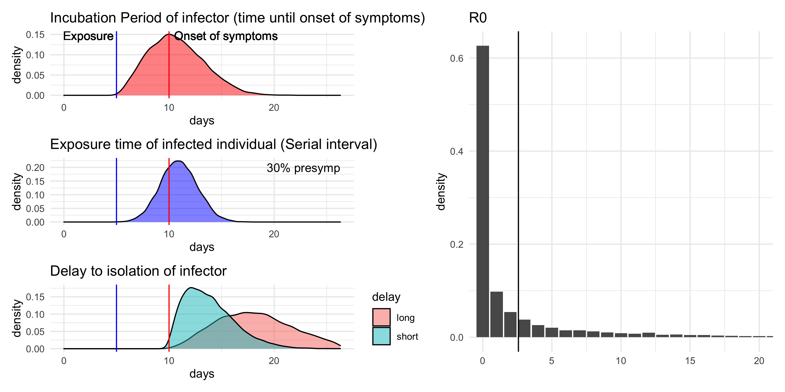
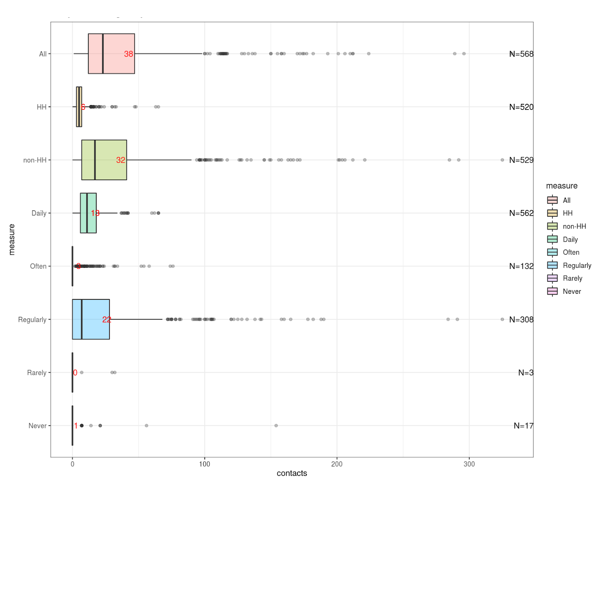
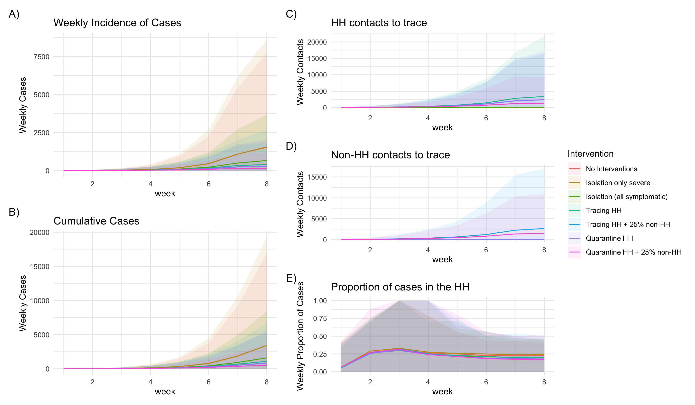
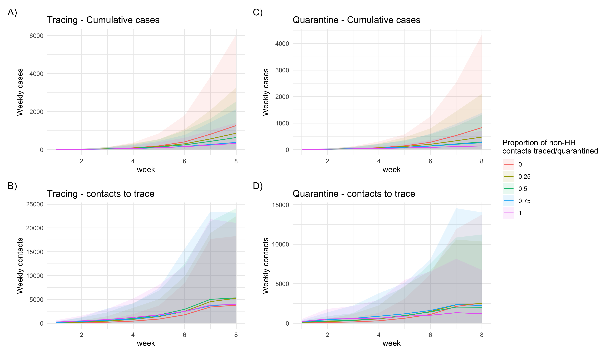

# Quantifying the impact of and effort involved in contact tracing cases using contact data for Kenya

## Introduction

Multiple international cases of the novel coronavirus disease (COVID-19) have been observed outside of China since the start of the epidemic. Whilst the majority of these are exported cases with a direct link to the epidemic in China, some countries are seeing cases of sustained onwards transmissions. Outbreaks in other countries of the magnitude observed in China would pose a significant strain on public health resources, in particular in resource poor settings across Africa. To limit this, early case detection and transmission prevention at the start of an outbreak is crucial.

Contact tracing forms one such prevention measure, where close contacts of an infected case are traced. The effectiveness of this depends heavily on the natural history of infection, in particular the proportion of pre- and asymptomatic transmission occurring, as has been [shown recently](https://www.thelancet.com/journals/langlo/article/PIIS2214-109X(20)30074-7/fulltext). A further limitation is the amount of resources involved in tracing close contacts . Thus, informed decisions must be made of when and how to best implement contact tracing. Such decisions can be guided by models that simulate transmission across contact networks.

This study extends a [previously developed model](https://www.thelancet.com/journals/langlo/article/PIIS2214-109X(20)30074-7/fulltext) of contact tracing to include the use of [diary-based contact data](https://journals.plos.org/plosone/article?id=10.1371/journal.pone.0104786) to form a more realistic, context-specific picture of the effect of contact tracing. We have information on age-grouped contacts in a single day and the usual frequency of each contact for over 500 study participants in rural and urban settings. We resample contacts of each participant based on their recorded frequency to create a synthetic set of contacts across multiple days. The participants and their contacts then form our study population into which we introduce initial infected cases and then simulate the early stages of an outbreak. Using this model we explore the effectiveness of different strategies for contact tracing, including the isolation of household contacts, under different transmission scenarios. This study aims to inform the ministry of health on how they may be able to effectively implement contact tracing strategies and at which point resources should be focused on other intervention strategies.

## Methods 

### Contacts

#### Sampling from the contact data
For each outbreak simulation we sample (with replacement) *n* participants and their contacts from the original contact data collected by [Kiti et al.](https://journals.plos.org/plosone/article?id=10.1371/journal.pone.0104786). As this study included both semi-urban and rural settings, we also allow for sampling with a given urban-rural divide. Thus we can form populations of different sizes and settings, assuming that the contacts are representative of urban/rural contacts across Kenya.

#### Repeated vs unique contacts in a given time period
We have information on the frequency of a contact and the survey definitions of these, so we can assign a probability p of meeting that contact on a given day:
* Daily -> *p=1*
* Often 1-2 times per week -> *p=(1.5/7)*
* Regular 1-2 times per month -> *p=(1.5/30)*
* Rarely <1 times per month -> *p=(0.5/30)*
* Never -> *p=0*

We assume that, given a participant, the contacts for a single day are representative of any other day. So if we have a single contact of a certain frequency on day one, this contact is repeated for the remaining *t-1* days. Then, based on the frequencies above, this contact has probability *p* of being repeated. So for each day, *1-p* gives the probability that a contact is a new contact. If a new contact occurs, the probability of a further new contact on the following days is *(1-p)^2*, and so on. Random numbers between 0 and 1 are drawn each day to determine whether new contacts have occurred. Weights are added to these contacts according to the expected frequency of contact during that period. Thus for *t=7* days, “Daily” contacts will have a weight of 7, while the “Never” contacts have a weight of 1. Infections are later matched according to these weights during the infection step.
The final output is a full contact data set with participant and contact ids. This defines the susceptible population during the outbreak and for each id (contact and participant), we keep track of who becomes infected.

### Infection Step

#### Sampling transmission and isolation parameters

The infection and isolation steps are taken directly from the [LSHTM model](https://github.com/epiforecasts/ringbp). In the following we distinguish between: infectors individuals that infect during the infection step, and infecteds individuals that become infected during the infection step. Parameter distributions are shown in Figure 1.
For each infector we sample an incubation period and a delay to isolation. These determine, when the infector shows symptoms and, following this, becomes isolated. Isolation in this case does not represent isolation based on contact tracing, but rather isolation based on the individual self-isolating or seeking health care and thus being isolating. In addition, we sample R0 to determine how many new infecteds the infector produces. Based on the infectors incubation period, we sample a serial interval for each infected, which we define as the time from the infector’s exposure to the infected’s exposure. Here a predefined proportion of serial intervals are smaller than the incubation period to model pre-symptomatic transmission events. If a serial interval is chosen such that infection occurs after the infector’s isolation time, the infection does not occur. In addition we allow for a proportion of asymptomatic cases, for which isolation never occurs. Depending on the scenario these may represent cases that are too mild to warrant self- or health care based-isolation, or asymptomatic cases that are missed by contact tracing. For the intervention scenarios, each infected case also has a certain probability of being missed by tracing or quarantine in which case they will continue transmitting until they are isolated with a delay following symptom onset (or not isolated if asymptomatic).
Thus, for each infection step we determine, which individuals become infected and/or isolated and/or traced. Once a contact becomes isolated, their R0 reduces to 0 and they can no longer infect other individuals. Different scenarios are illustrated in detail in figure S8 of the [LSHTM study](https://www.thelancet.com/journals/langlo/article/PIIS2214-109X(20)30074-7/fulltext).

#### Matching infections to contacts

Here we extend the LSHTM model to include realistic contact data. Given an infector with a number of potential infecteds (based on a sample from R0), infections are matched to the infector's contacts. In our contact data, individuals are either study participants or study contacts. We consider two scenarios:
1. The infector is a study participant: We know all their contacts already.
2. The infector is a study contact:  We don't know the full set of contacts here and have to sample from the rest of the contact data. We again have two scenarios: (a) The individual was infected through the HH, thus we know their household (HH) contacts, as these are linked to their infector. The non-household (non-HH) contacts are sampled from the non-HH contacts of a participant of the same age group. Note that this may introduce some biases as their may be a relationship between the number of HH and non-HH contacts by age; (b) The individual was infected outside the HH. In this case we sample a random participant of the same age and use their HH and non-HH contacts.

We then assign which of the contacts become infected based on their weight. There are three scenarios that reduce the pool of susceptible contacts:
1. The amount of contacts available to an infector. There will be random draws of R0 that are larger than the total contacts available, in which case all contacts become infected.
2. A contact has already been infected. If n, the study population, is large most of these pre-existing infections will be HH contacts formed through HH clusters.
3. Duplicate infections. The model is run in generations, where each generation represents all the infections that occur from the infecteds of the previous generation. During the infection step, multiple infectors may infect the same individual. Again if n, the study population, is large most of these duplicated infections will be within the same HH.

#### Counting contacts

In addition to assigning infecteds based on the infector's contacts, we keep track of the number of HH and non-HH contacts each infected individual has. This allows us to count the number of contacts that need to be traced. If an infected individual was infected through the HH, we set their HH contacts to be traced to zero to avoid double counting, as these will have been traced already through the infector. We ignore double counting of non-HH contacts, which assumes that non-HH contacts are not shared amongst individuals.

### Interventions

We consider different types of intervention scenarios:
* No intervention: No isolation of cases and infected individuals infect according to their contacts. The proportion of asymptomatics is set to 1 here.
* Isolation: Here isolation occurs for a proportion of individuals after a delay following symptom onset.
* Tracing: All traced contacts that are infected become isolated immediately upon symptom onset (apart from the ones that are missed or if asymptomatic)
* Quarantine: All traced contacts that are infected become isolated immediately when the infector becomes isolated (apart from the ones that are missed)

Each layer of intervention reduces the delay from exposure to isolation. Tracing reduces the delay from onset to isolation, while quarantine can reduce some of the presymptomatic transmission events, as individuals may be isolated before symptom onset. The proportion of asymptomatics effectively determines who the intervention applies to. Thus this proportion can capture different severities of disease. For the tracing and quarantine scenarios, we distinguish between HH and non-HH contacts and set the probability of a HH contact being missed to zero while we alter the probability of missing a non-HH contact.

## Results

###Synthetic contact data

To explore the accumulation of contacts across multiple days, we built a [shiny app](https://moritzwagner.shinyapps.io/Counting_Contacts/). This allows you to sample from the original contact data by a given urban-rural divide, set a time period of accumulating contacts and produces boxplots of the expected number of contacts overall, by household and non-household, and by frequency of contact. Figure 2 shows an example output of the app for a 30% urban population accumulating contacts across 7 days, we estimate that there are around 38 distinct contacts made with 6 and 32 within and outside of the household, respectively. A mean of 40 contacts is in line with what has been reported for tracing efforts in [other settings](https://science.sciencemag.org/content/early/2020/03/13/science.abb3221)

### Outbreak simulations
We s
ample 10,000 participants from the contact data and after accumulating contacts over a 7 day period, this results in a contact dataset of approximately 300,000 individuals. This constitutes our susceptible population. For each intervention scenario we run 100 simulations of an outbreak seeded with 5 initial infectors for 8 weeks. For computational efficiency any outbreak simulations that accumulate over 5000 cases are stopped, as we define this to be beyond the scope of contact tracing efforts.
We compared a number of different intervention strategies:
1. **No intervention:** No isolation of cases and infected individuals infect according to their contacts.
2. **Isolation only severe:** Assuming that 20% of cases are severe (?), only severe cases are isolated after a delay following symptom onset. This may be equivalent to isolating only cases that require hospitalisation.
3. **Isolation of all symptomatic cases:** Assuming that 80% cases are symptomatic (?), all symptomatic cases are isolated after a delay following symptom onset. This may be equivalent to ensuring that anyone with symptoms self-isolates.
4. **Tracing HH:** All the household contacts of an isolated individual are traced and isolated without delay following symptom onset. All non-traced symptomatic individuals are isolated after a delay following symptom onset (as in 3.).
5. **Tracing HH + 25% non-HH:** All the household contacts and 25% of non-household contacts of an isolated individual are traced and isolated without delay following symptom onset. All non-traced symptomatic individuals are isolated after a delay following symptom onset (as in 3.).
6. **Quarantine HH:** All the household contacts of an isolated individual are traced and isolated immediately (not following symptom onset). All non-traced symptomatic individuals are isolated after a delay following symptom onset (as in 3.).
7. **Quarantine HH + 25% non-HH:** All the household contacts and 25% of non-household contacts of an isolated individual are traced and isolated immediately (not following symptom onset). All non-traced symptomatic individuals are isolated after a delay following symptom onset (as in 3.).

Figure 3 shows the weekly mean and 95% prediction intervals of weekly cumulative cases, the weekly number of HH and non-HH contacts needed to be traced, and the proportion of weekly cases that are within the HH for each intervention scenario. The no intervention scenario and isolating only severe cases are very similar, resulting in a mean of 2500 cumulative cases in 8 weeks. Figure 4 shows scenarios where all HH contacts are traced or quarantined and different proportions of the non-HH contacts are traced or quarantined. As to be expected, the higher the proportion of non-HH contacts that are traced, the lower the case load. In turn as there are less cases, less contacts need to be traced, so even if a higher proportion of contacts need to be found per individual, the overall number of contacts that need to be traced/quarantined remains in a similar range. For tracing, there does seem to be a threshold value where tracing over 50% of non-HH contacts there is more additional benefit and the contacts to be traced are reduced significantly (from 5000 contacts in week 8 with 25% and 50% tracing to 4000 with 75% and 100% tracing). 

## Discussion

Under the present assumptions, the most effective strategy would be to quarantine households and as many non-household contacts as possible of any symptomatic case that is reported.
This ensures that 80% of the simulations maintain less than 1000 cases cumulatively. However, even if only 25% of the non-household contacts are found, by week 8 of this strategy the number of contacts to be traced in a single week could be over 5000. In contrast, if no interventions are in place or only severe cases are isolated, by the 8th week the outbreak could have up to 5000 cases with 50% of simulations resulting in more than 1000 cases. Given the dynamic relationship between isolating contacts and potential onwards transmission, tracing or quarantining a higher proportion of non-HH contacts can result in less cases, whilst simultaneously having to trace a similar amount of contacts overall. For tracing, there is an added benefit that if 75% or more non-HH contacts are traced, there could be fewer cases as well as fewer contacts to trace.
Our shiny app shows that tracing all HH and 75% of non-HH contacts over a period of 7 days, would require around 30 contacts on average per infected individual. This tool could allow public health officials to quickly estimate how many contacts they may expect to have to trace for an infected individual.

## Limitations

* Projections do not account for any other interventions such as banning of large gatherings, school closures and/or social distancing measures which is likely to affect external (to household) contacts.
* While the contact patterns might be representative of the population in rural and semi-urban settings, we have not matched the synthetic population by the age and household size distribution of the Kenyan population
* The contact data is relatively old (from 2014).
* Contact patterns do not represent an urban setting, as such possible cannot be used to represent an area like Nairobi. 
* The types of contacts of a single day are representative of any other day and repeated every day.
* Tracing and quarantine scenarios assume no delay to isolation, i.e. the time to find contacts is not considered.
* Currently in the model the quarantine effect does not apply to all contacts, but only those that eventually get infected. This would matter in the HH especially.
* Susceptibility and infectiousness is the same across age groups and severity.