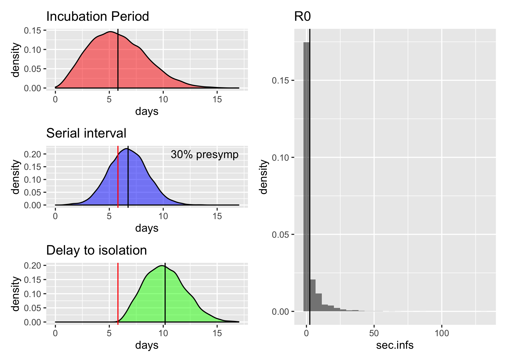
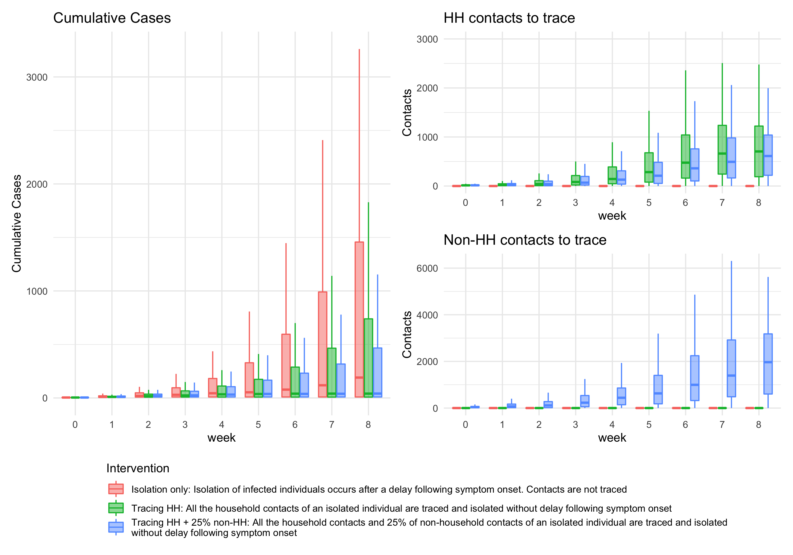

# Quantifying the impact of and effort involved in contact tracing cases using contact data for Kenya

## Introduction

Multiple international cases of the novel coronavirus disease (COVID-19) have been observed outside of China since the start of the epidemic. Whilst the majority of these are exported cases with a direct link to the epidemic in China, some countries are seeing cases of sustained onwards transmissions. Outbreaks in other countries of the magnitude observed in China would pose a significant strain on public health resources, in particular in resource poor settings across Africa. To limit this, early case detection and transmission prevention at the start of an outbreak is crucial.

Contact tracing forms one such prevention measure, where close contacts of an infected case are traced. The effectiveness of this depends heavily on the natural history of infection, in particular the proportion of pre- and asymptomatic transmission occurring, as has been [shown recently](https://www.thelancet.com/journals/langlo/article/PIIS2214-109X(20)30074-7/fulltext). A further limitation is the amount of resources involved in tracing close contacts . Thus, informed decisions must be made of when and how to best implement contact tracing. Such decisions can be guided by models that simulate transmission across contact networks.

This study extends a [previously developed model](https://www.thelancet.com/journals/langlo/article/PIIS2214-109X(20)30074-7/fulltext) of contact tracing to include the use of [diary-based contact data](https://journals.plos.org/plosone/article?id=10.1371/journal.pone.0104786) to form a more realistic, context-specific picture of the effect of contact tracing. We have information on age-grouped contacts in a single day and the usual frequency of each contact for over 500 study participants in rural and urban settings. We resample contacts of each participant based on their recorded frequency to create a synthetic set of contacts across multiple days. The participants and their contacts then form our study population into which we introduce initial infected cases and then simulate the early stages of an outbreak. Using this model we explore the effectiveness of different strategies for contact tracing, including the isolation of household contacts, under different transmission scenarios. This study aims to inform the ministry of health on how they may be able to effectively implement contact tracing strategies and at which point resources should be focused on other intervention strategies.

## Methods 

### Contacts

#### Sampling from the contact data
For each outbreak simulation we sample (with replacement) *n* participants and their contacts from the original contact data collected by [Kiti et al.](https://journals.plos.org/plosone/article?id=10.1371/journal.pone.0104786). As this study included both urban and rural settings, we also allow for sampling with a given urban-rural divide. Thus we can form populations of different sizes and settings, assuming that the contacts are representative of urban/rural contacts across Kenya. In this step we also deal with some of the missing data:
* share_HH==TRUE & how_often=="Missing" -> how_often=="Daily"
* how_often=="Missing" & ever_met=="No" -> how_often=="Never"
* how_often=="Missing" that are left are sampled from the rest of the data with the same age of participant, age of contact and location of contact

#### Repeated vs unique contacts in a given time period
We have information on the frequency of a contact and the survey definitions of these, so we can assign a probability p of meeting that contact on a given day:
* Daily -> p=1
* Often 1-2 times per week -> p=(1.5/7)
* Regular 1-2 times per month -> p=(1.5/30)
* Rarely <1 times per month -> p=(0.5/30)
* Never -> p=0

We assume that, given a participant, the contacts for a single day are representative of any other day. So if we have a single contact of a certain frequency on day one, this contact is repeated for the remaining t-1 days. Then based on the frequencies above, this contact has probability p of being repeated. So for each day, 1-p gives the probability that a contact is a new contact. If a new contact occurs, the probability of a further new contact on the following days is (1-p)^2, and so on. Random numbers between 0 and 1 are drawn each day to determine whether new contacts have occurred. The current model accumulates contacts across a two week period (**sensitivity analysis?**). Weights are added to these contacts according to the expected frequency of contact during that period. Thus daily contacts will have a weight of 14, while new contacts have a weight of 1. Infections are later matched according to these weights during the infection step.

The final output is a full contact data set with participant and contact ids. This defines the susceptible population during the outbreak and for each id (contact and participant), we keep track of who becomes infected.

### Infection and isolation times
This is an extension of the [LSHTM model](https://github.com/epiforecasts/ringbp) to include realistic contact data. For each infector, a number of parameters are sampled (see figure below for distributions):
* incubation period (time)
* serial interval (time): For each incubation period a corresponding serial interval is sampled according to the proportion of pre-symptomic transmission. For each potential new infection (based on R0), this determines their time of exposure
* delay to isolation (time): This is a measure of how long it takes from symptom onset for a case to be discovered (by seeking health care) and thus be isolated. Note that this does not represent isolation based on contact tracing.
* asymptomatic case (TRUE/FALSE): Each case has a certain probability of being asymptomatic/subclinical. If this is the case, they cannot be isolated. Transmission, however, is still possible
* R0 (integer): The expected number of secondary cases this individual may cause (this will be limited by the type of contacts they have and whether those have already been infected)
* missed case (TRUE/FALSE): Each case has a certain probability to be missed by tracing in which case they will continue transmitting until symptom onset+delay to isolation

Based on these, for each infection step we determine, which individuals become infected and/or isolated and/or traced. Once a contact becomes isolated, their R0 reduces to 0 and they can no longer infect other individuals. Different scenarios are illustrated in detail in [figure S8](https://www.medrxiv.org/content/medrxiv/suppl/2020/02/11/2020.02.08.20021162.DC1/2020.02.08.20021162-1.pdf) of the LSHTM study.

### Matching infections to contacts
Given an infector with a number of potential infecteds (based on a sample from R0), these now need to be matched to the infector's contacts. We consider two scenarios:
1. The infector is a participant: We know all their contacts immediately.
2. The infector is a contact: Here we don't know the full set of contacts. We know their household (HH) contacts, as these are linked to their participant. The non-household (non-HH) contacts are sampled from participants of the same age group. Note that this may introduce some biases as their may be a relationship between the number of HH and non-HH contacts by age. (**Need to sample by urban/rural as well**)

We then assign which of the contacts become infected based on their weight. There are three scenarios where contacts do not become infected and thus the effective reproduction number is reduced:
1. A contact has already been infected. If *n*, the study population, is large most of these pre-existing infections will be HH contacts formed through HH clusters.
2. The amount of contacts available to an infector, as there will be random draws of R0 that are larger than the total contacts.
3. Duplicate infections. The model is run in generations, where each generation represents all the infections that occur from the infecteds of the previous generation. During the infection step, multiple infectors may infect the same individual. Again if *n*, the study population, is large most of these duplicated infections will be within the same HH.

### Intervention Scenarios

* **Isolation upon onset:** Here isolation occurs with a delay upon onset of symptoms, i.e. no tracing of contacts
* **Tracing:** All traced contacts that are infected become isolated immediately upon symptom onset (apart from the ones that are missed or if asymptomatic)
* **Quarantine:** All traced contacts that are infected become isolated immediately when the infector becomes isolated (apart from the ones that are missed)
* **Quarantine plus:** All traced contacts become isolated immediately when infector becomes isolated (apart from the ones that are missed)

For the tracing and quarantine scenarios, we distinguish between HH and non-HH contacts and set the probability of a HH contact being missed to zero while we alter the probability of missing a non-HH contact.

## Outputs

* Epidemic curves
* Number of contacts that need to be traced
* R effective
* Number of outbreaks that are controlled: [LSHTM](https://www.thelancet.com/journals/langlo/article/PIIS2214-109X(20)30074-7/fulltext) define this as outbreaks where transmission ended within 12 weeks or before 5000 cases in total. Perhaps a similar measure that also takes into account the amount of contacts that require tracing?
* How many contacts need to be traced to succesfully control an outbreak?

See below a preliminary example output:

## Key Assumptions
* Contact data are representative and can be extrapolated to larger populations
* The types of contacts of a single day are representative of any other day and repeated every day
* The average frequency of a contact for a given period determines the weighted risk of infection, i.e. more frequent contacts are more likely to become infected
* Contacts over a two week period determine who gets traced and can get infected. Even if contacts become infected in a shorter period. The weighting of more frequent contacts (point above) offsets some of this bias, as frequent contacts are just as likely to occur during shorter periods as during longer ones.
* Tracing and quarantine scenarios assume no delay to isolation, i.e. the time to find contacts is not considered